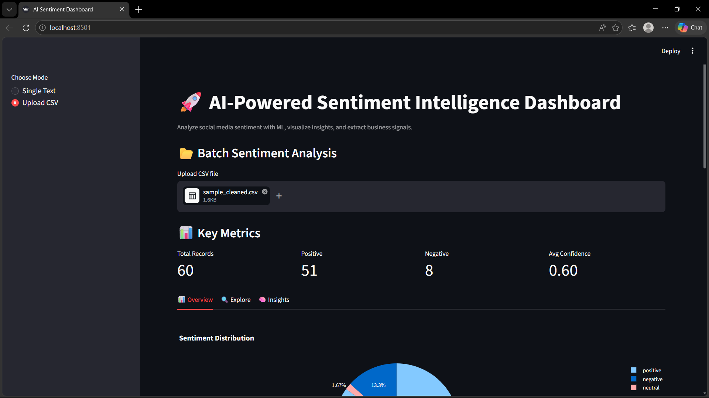
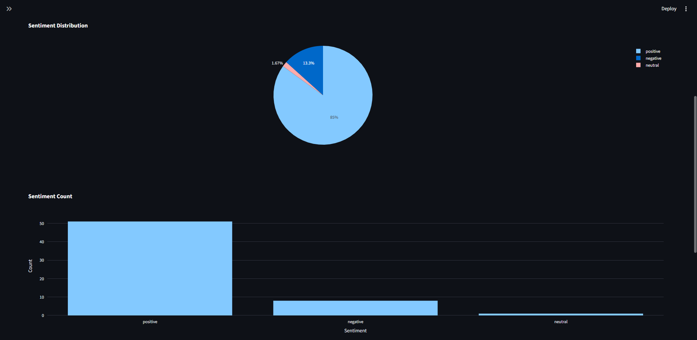
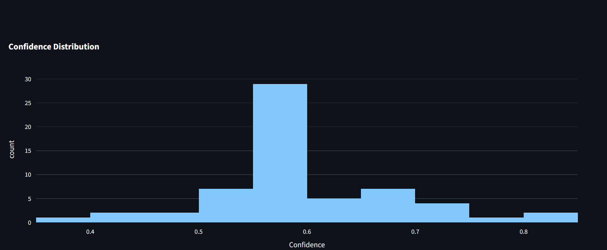
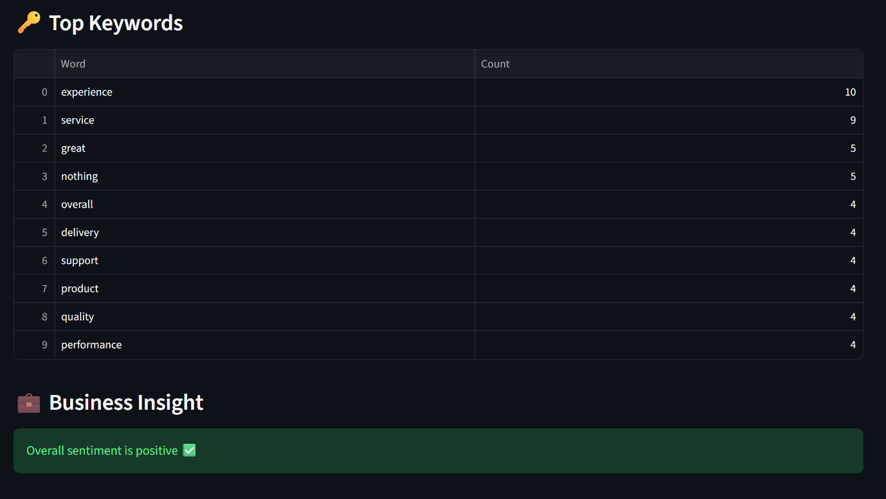
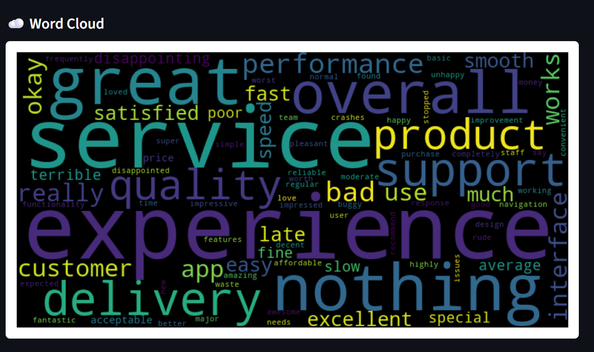
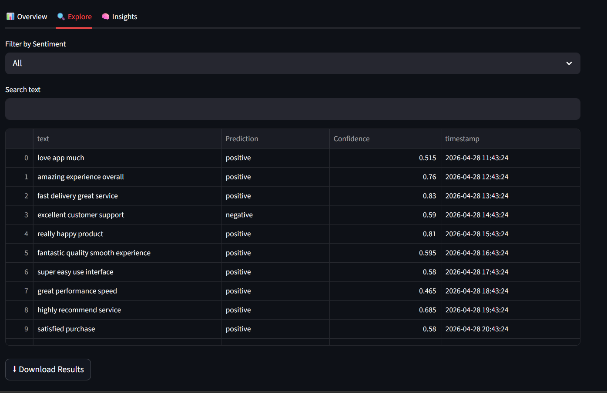
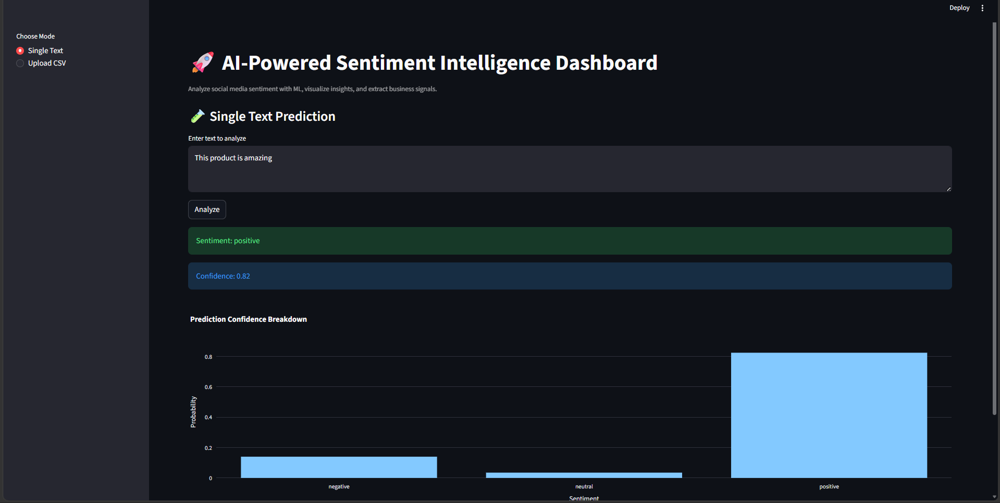
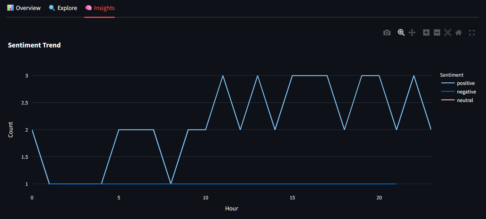
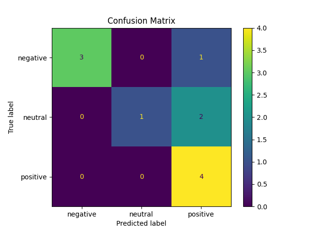
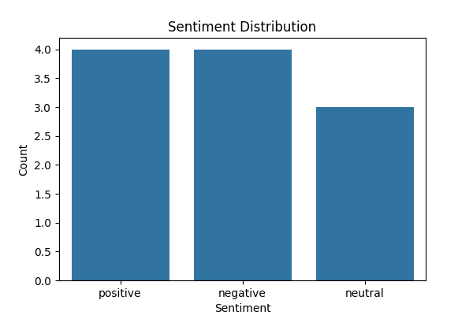

# 🚀 AI-Powered Social Media Sentiment Analysis Dashboard

> 🚀 AI-powered sentiment intelligence dashboard for analyzing social media text using NLP and Machine Learning.

---

## 📊 Overview
This project is an end-to-end Machine Learning and NLP system that analyzes social media text and classifies sentiment into:

- 😊 Positive  
- 😡 Negative  
- 😐 Neutral  

It also provides an **interactive dashboard** to visualize insights, trends, and predictions.

---

## 🎯 Key Features

- 🔮 Real-time sentiment prediction (Single text input)
- 📂 Batch sentiment analysis using CSV files
- 📊 Interactive charts (Pie, Bar, Histogram)
- ☁️ Word Cloud visualization
- 🔑 Top keyword extraction
- 📈 Sentiment trend analysis over time
- 💡 Business insights generation
- 📥 Download processed results

---

## 🛠 Tech Stack

- **Language:** Python  
- **Libraries:** Pandas, NumPy, Scikit-learn, NLTK  
- **Visualization:** Plotly, Matplotlib, WordCloud  
- **Framework:** Streamlit  
- **Model:** Random Forest Classifier  
- **NLP Technique:** TF-IDF Vectorization  

---

## 🧠 Project Architecture

Text Data → Cleaning → TF-IDF → Random Forest → Prediction → Dashboard → Insights

---

## 📁 Folder Structure

Social-Media-Sentiment-Analysis-Dashboard/
│
├── data/
│ ├── raw/
│ ├── processed/
│
├── notebooks/
│ └── experimentation.ipynb
│
├── src/
│ ├── preprocess.py
│ ├── train.py
│ ├── predict.py
│ ├── evaluate.py
│
├── models/
│ ├── sentiment_model.pkl
│ ├── vectorizer.pkl
│
├── app/
│ └── app.py
│
├── outputs/
│ ├── confusion_matrix.png
│ ├── sentiment_distribution.png
│
├── images/
│ ├── dashboard.png
│ ├── charts_1.png
│ ├── charts_2.png
│ ├── insights_1.png
│ ├── insights_2.png
│ ├── explore.png
│ ├── prediction.png
│ ├── trend.png
│ ├── confusion_matrix.png
│ ├── sentiment_distribution.png
│
├── docs/
├── requirements.txt
└── README.md

---

## ▶️ How to Run

### 1️⃣ Clone Repository

git clone https://github.com/VaishnavaDevi-R/social-media-sentiment-analysis-dashboard.git

cd social-media-sentiment-analysis-dashboard

---

### 2️⃣ Create Virtual Environment

python -m venv venv
venv\Scripts\activate

---

### 3️⃣ Install Dependencies

pip install -r requirements.txt

---

### 4️⃣ Download NLTK Data

python -c "import nltk; nltk.download('stopwords')"

---

### 5️⃣ Train Model

python src/train.py

---

### 6️⃣ Run Dashboard

streamlit run app/app.py

---

## 📸 Project Screenshots

### 🔹 Dashboard Overview

---

### 🔹 Charts & Visualizations
  

---

### 🔹 Insights & Word Cloud
  

---

### 🔹 Data Exploration

---

### 🔹 Sentiment Prediction

---

### 🔹 Sentiment Trend

---

### 🔹 Model Evaluation
  

---

## 📊 Sample Output

- ✔ Sentiment classification  
- ✔ Confidence scores  
- ✔ Data visualization  
- ✔ Business insights  

---

## 💼 Real-World Applications

- 🛒 E-commerce → Product reviews analysis  
- 🍔 Food delivery → Customer feedback monitoring  
- 🎬 Streaming platforms → Viewer sentiment tracking  
- 🏦 Banking → Customer satisfaction analysis  
- 🗳 Political campaigns → Public opinion analysis  

---

## 🧠 Learning Outcomes

- Natural Language Processing (NLP)
- Machine Learning model building
- Feature engineering using TF-IDF
- Dashboard development using Streamlit
- Data visualization and insights generation

---

## 🚀 Future Improvements

- Use deep learning models (BERT, LSTM)
- Real-time data integration (Twitter API)
- Deploy on cloud (Streamlit Cloud / AWS)
- Improve UI/UX design

---

## 👤 Author

**Vaishnava Devi**  
💻 GitHub: https://github.com/VaishnavaDevi-R  
🔗 LinkedIn: https://www.linkedin.com/in/vaishnava-devi-141142321/

---

## ⭐ If you like this project, give it a star!